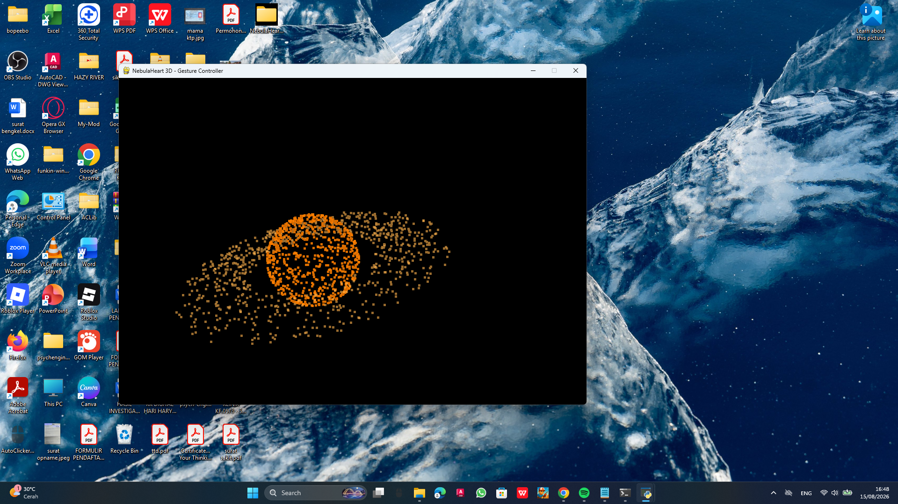

<div align="center">

# 🌌 NebulaHeart 3D

### ✋ Pengalaman Visual 3D yang Dikendalikan dengan Gerakan Tangan

**Project Python interaktif yang menggabungkan hand tracking, computer vision, partikel 3D, dan OpenGL.**

<br>



<br><br>


</div>

---

## ✨ Tentang Project

**NebulaHeart 3D** adalah project interaktif berbasis Python yang menggunakan **kamera laptop untuk mendeteksi gerakan tangan** dan mengubahnya menjadi berbagai bentuk partikel 3D.

Project ini menggabungkan:

- ✋ Deteksi gerakan tangan
- 👁️ Computer Vision
- 🌌 Partikel 3D
- 🎮 Grafik OpenGL
- 🐍 Pemrograman Python

Tujuannya adalah membuat pengalaman visual yang menarik sekaligus menjadi proyek untuk mempelajari **Python, computer vision, hand tracking, dan grafik 3D**.

---

## ✋ Kontrol Gerakan Tangan

| Gerakan | Hasil |
|:---:|---|
| 🖐️ Telapak terbuka | 🌌 Kosmos |
| ☝️ Satu jari | 🪐 Saturnus 3D |
| ✌️ Peace | 💙 **I LOVE U** |
| ✊ Kepal | ❤️ Bentuk Hati |

---

## 🎥 Cara Kerja

```text
        📷 Kamera
           │
           ▼
   ┌─────────────────┐
   │    MediaPipe    │
   │  Hand Tracking  │
   └────────┬────────┘
            │
            ▼
   ┌─────────────────┐
   │ Deteksi Gestur  │
   └────────┬────────┘
            │
            ▼
   ┌─────────────────┐
   │ Pemilihan Mode  │
   └────────┬────────┘
            │
            ▼
   ┌─────────────────┐
   │  Partikel 3D    │
   │     OpenGL      │
   └─────────────────┘
